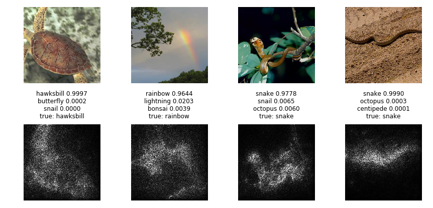

# Image Classification Experiments on Caltech-256 dataset
## Results

| model | accuracy, % | top 5 accuracy, %| number of parameters |
| --- | --- | --- | --- |
| DenseNet-121    | 85 | 96 | 7,216,256 |
| DenseNet-121 with trained ternary quantization | 73 | 91 | ~7.2M 2-bit, ~79% zeros |
| DenseNet-121 with binary weights | 41 | 67 | ~7.2M 1-bit |
| DenseNet-201    | 87 | 97 | 18,584,704 |
| ResNet-18 | 81 | 94 | 11,307,840 |
| ResNet-18 with trained ternary quantization | 52 | 78 | ~11M 2-bit, ~86% zeros |
| ResNet-18 with stochastic depth | 70 | 89 | 11,307,840 |
| SqueezeNet v1.1 | 66 | 85 | 853,824 |
| SqueezeNet v1.1 with entropy regularization | 66 | 86 | 853,824 |
| Delegating classifiers | 77 | 93 | - |

### Trained ternary quantization
Trained ternary quantization [2] is a method of reducing size of a neural network. It replaces all weights in a convolutional layer with +1, 0, -1 and two float scaling factors (one for +1 and one for -1).

### Binary-Weights-Networks

### Stochastic depth

### Entropy regularization

### Delegating classifiers

### SmoothGrad
SmoothGrad is a method of computing nice sensitivity maps. Sensitivity maps show which image pixels influence class predictions. They require to compute gradients with respect to an input image. Here are a few examples:

## Implementation details

## Notes
* I often use cosine annealing [6] of the learning rate. I believe that this reduces training time
a lot.

## Requirements
* Python 3.5
* pytorch 0.2
* torchvision, Pillow
* numpy, pandas, sklearn, matplotlib, tqdm

## References
[1] [Regularizing Neural Networks by Penalizing Confident Output Distributions](https://arxiv.org/abs/1701.06548)

[2] [Trained Ternary Quantization](https://arxiv.org/abs/1612.01064)

[3] [Deep Networks with Stochastic Depth](https://arxiv.org/abs/1603.09382)

[4] [SmoothGrad: removing noise by adding noise](https://arxiv.org/abs/1706.03825)

[5] [XNOR-Net: ImageNet Classification Using Binary Convolutional Neural Networks](https://arxiv.org/abs/1603.05279)

[6] [Snapshot Ensembles: Train 1, get M for free](https://arxiv.org/abs/1704.00109)
